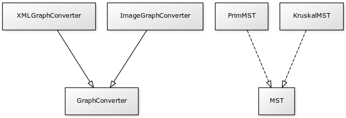

# TO-MST
Aplikacja przygotowana w ramach zajęć z Technologii Obiektowych na Politechnice Krakowskiej.

Aplikacja pozwala na konstruowanie minimalnych drzew rozpinających przy użyciu dwóch algorytmów Prime'a i Kruskala. Program umożliwia wczytanie danych z pliku  oraz wygenerowanie plików graficznych z wynikami działania algorytmów.

# Autorzy
## Struktury danych i integracja projektu
Darek Matoga

## Algorytm Prima
Szymon Kolasa

Tomasz Jach

## Algorytm Kruskala
Dawid Maciejowski

Andrzej Mucha 

## Obsługa plików i rysowanie
Andrzej Zeżuła

Krzysiek Jarończyk

## Dokumentacja
Mateusz Kolasa

# Diagram klas

